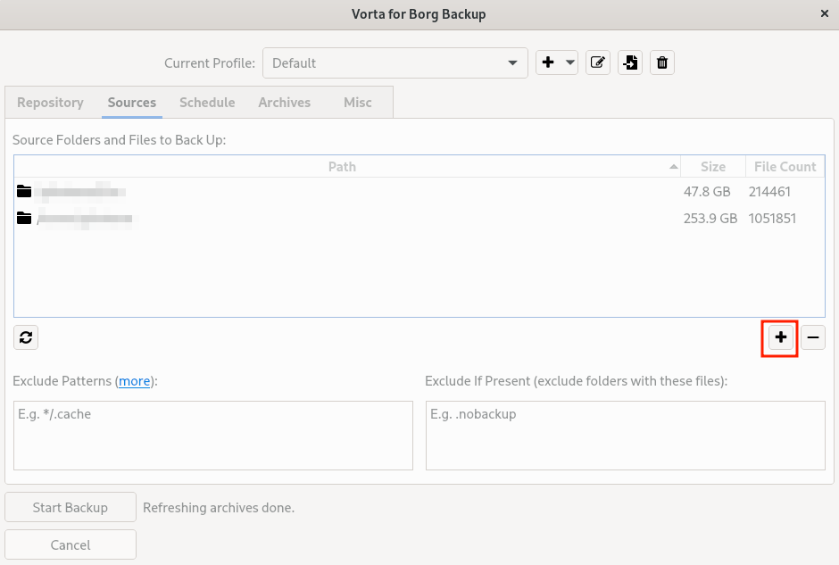

# 1. NFS AUTO MOUNT

Install autofs:
```
sudo dnf install autofs -y
sudo systemctl enable --now autofs
```

Edit /etc/auto.master

```
/mnt/autofs /etc/auto.nfs --timeout=60
```

Create file auto.nfs

```
truenas-bkp -rw,bg,intr <nas-ip>:/mnt/pool0/backup/redhat/laptop
```

Create dir, set permissions and restart service

```
mkdir -p /mnt/autofs/truenas-bkp
sudo chmod 644 /etc/auto.nfs
sudo systemctl restart autofs
```

# 2. Vorta Backup (Fedora)

Install vorta backup:

```
sudo dnf install vorta
```

Open it and click on + signal and `New repository`


Click on folder icon:


Select `/mnt/autofs/truenas-bkp` and set a passphrase.


Note: You will need this passphrase later if you need to restore backup in another workstation.

You should see the new repository set now


Add new sources by clicking in the button with `+` sign:



Set schedule interval for your backups, if you want to:


Click on `Start Backup`. First time is expect to take long time, depending on the ammount of data you want to backup, and things like the network speed and NAS. Other backups are incremental, so it is expected to take way less time to complete.

