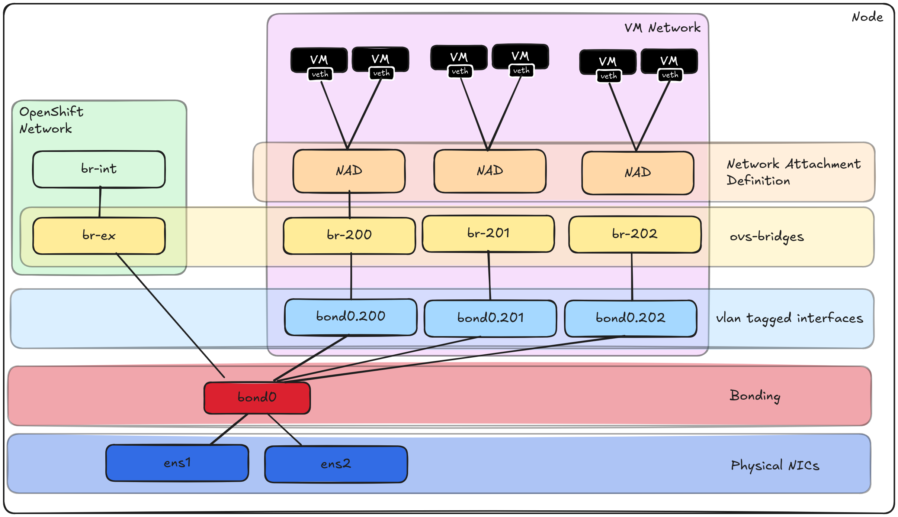

# Deploying multiple VLANs on top of a single Bond using ovs-bridges

These files will configure an OpenShift cluster with the following configuration:

  

## Procedure

**1. Apply the NNCP files (`vlanXXX-nncp.yaml`) and make sure it got created. Important: Set node selectors if you don't want to apply it in the entire cluster.**

**2. Apply the NAD files (`ovs-bridge-vlanXXX-nad.yaml`):**

**3. Deploy your VMs with interfaces using the NAD and validate the network:**

*VM Network Configuration*

*Note VMs got IPs from each different VLAN*

*Simple connectivity test*

