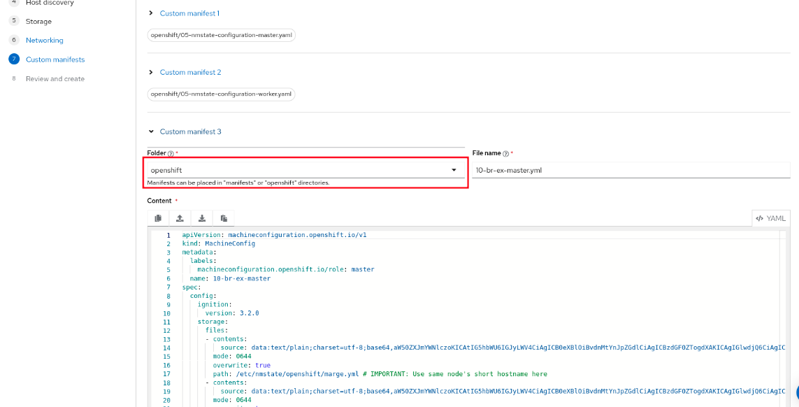

# OpenShift Bond with No Switch Configuration (OVS-based balance-slb) 

## Architecture

This procedure deploys OpenShift with the following architecture.

<center></center>


## Deployment procedure with Assisted Installer

*Tested with OpenShift 4.17.18 and 4.18.1*

1. Install the cluster with Assisted Installer as usual, but enable the option `Include custom manifests` and `Static network configuration`.

<center>

</center>

2. Use the network static configuration, setting NIC 1 only to have an IP and disabling IPV4 and IPV6 on NIC 2. Additionally, make sure to appropriately rename the interfaces (eno1, eno2). Use [net-init-conf for DHCP](dhcp/net-init-conf.yml) or [net-init-conf for static IP](static/net-init-conf.yml).

<center>

</center>

3. Proceed with the installation as usual. At the `Custom manifests` step, create the following manifests. Use **openshift** as the folder.

    3.1. Add [05-nmstate-configuration-master.yaml](common/05-nmstate-configuration-master.yaml) and [05-nmstate-configuration-worker](common/05-nmstate-configuration-worker)

    3.2. In a linux workstation, customize [dhcp/cluster.yml](dhcp/cluster.yml) for DHCP or [static/(server).yml](static/master1.yml) for static IP and run the following commands to generate `10-br-ex-master-mc.yml` and `10-br-ex-worker-mc.yml` machine config files and add them as custom manifests. Note that, for static IP, the file names have to be the server short name (example: if server name is `server1.example.com`, so the file name has to be `server1.yml`).

**DHCP:**

```
CLUSTER=$(cat dhcp/cluster.yml | base64 -w0)

cat <<EOF > 10-br-ex-master-mc.yml
apiVersion: machineconfiguration.openshift.io/v1
kind: MachineConfig
metadata:
  labels:
    machineconfiguration.openshift.io/role: master
  name: 10-br-ex-master
spec:
  config:
    ignition:
      version: 3.2.0
    storage:
      directories:
      - path: /run/nodeip-configuration
        mode: 0755
        overwrite: true
      files:
      - contents:
          source: data:text/plain;charset=utf-8;base64,IyBUaGlzIGNvbmZpZ3VyYXRpb24gZmlsZSBjaGFuZ2VzIE5ldHdvcmtNYW5hZ2VyJ3MgYmVoYXZpb3IgdG8KIyB3aGF0J3MgZXhwZWN0ZWQgb24gInRyYWRpdGlvbmFsIFVOSVggc2VydmVyIiB0eXBlIGRlcGxveW1lbnRzLgojCiMgU2VlICJtYW4gTmV0d29ya01hbmFnZXIuY29uZiIgZm9yIG1vcmUgaW5mb3JtYXRpb24gYWJvdXQgdGhlc2UKIyBhbmQgb3RoZXIga2V5cy4KClttYWluXQojIERvIG5vdCBkbyBhdXRvbWF0aWMgKERIQ1AvU0xBQUMpIGNvbmZpZ3VyYXRpb24gb24gZXRoZXJuZXQgZGV2aWNlcwojIHdpdGggbm8gb3RoZXIgbWF0Y2hpbmcgY29ubmVjdGlvbnMuCm5vLWF1dG8tZGVmYXVsdD0qCgojIElnbm9yZSB0aGUgY2FycmllciAoY2FibGUgcGx1Z2dlZCBpbikgc3RhdGUgd2hlbiBhdHRlbXB0aW5nIHRvCiMgYWN0aXZhdGUgc3RhdGljLUlQIGNvbm5lY3Rpb25zLgppZ25vcmUtY2Fycmllcj0qCg==
        mode: 0644
        overwrite: true
        path: /etc/NetworkManager/conf.d/00-server.conf
      - contents:
          source: data:text/plain;charset=utf-8;base64,$CLUSTER
        mode: 0644
        overwrite: true
        path: /etc/nmstate/openshift/cluster.yml
EOF
```

**STATIC IP:**

```
MASTER1=$(cat static/master1.yml | base64 -w0)
MASTER2=$(cat static/master2.yml | base64 -w0)
MASTER3=$(cat static/master3.yml | base64 -w0)
WORKER1=$(cat static/worker1.yml | base64 -w0)
WORKER2=$(cat static/worker2.yml | base64 -w0)

cat <<EOF > 10-br-ex-master-mc.yml
apiVersion: machineconfiguration.openshift.io/v1
kind: MachineConfig
metadata:
  labels:
    machineconfiguration.openshift.io/role: master
  name: 10-br-ex-master
spec:
  config:
    ignition:
      version: 3.2.0
    storage:
      directories:
      - path: /run/nodeip-configuration
        mode: 0755
        overwrite: true
      files:
      - contents:
          source: data:text/plain;charset=utf-8;base64,IyBUaGlzIGNvbmZpZ3VyYXRpb24gZmlsZSBjaGFuZ2VzIE5ldHdvcmtNYW5hZ2VyJ3MgYmVoYXZpb3IgdG8KIyB3aGF0J3MgZXhwZWN0ZWQgb24gInRyYWRpdGlvbmFsIFVOSVggc2VydmVyIiB0eXBlIGRlcGxveW1lbnRzLgojCiMgU2VlICJtYW4gTmV0d29ya01hbmFnZXIuY29uZiIgZm9yIG1vcmUgaW5mb3JtYXRpb24gYWJvdXQgdGhlc2UKIyBhbmQgb3RoZXIga2V5cy4KClttYWluXQojIERvIG5vdCBkbyBhdXRvbWF0aWMgKERIQ1AvU0xBQUMpIGNvbmZpZ3VyYXRpb24gb24gZXRoZXJuZXQgZGV2aWNlcwojIHdpdGggbm8gb3RoZXIgbWF0Y2hpbmcgY29ubmVjdGlvbnMuCm5vLWF1dG8tZGVmYXVsdD0qCgojIElnbm9yZSB0aGUgY2FycmllciAoY2FibGUgcGx1Z2dlZCBpbikgc3RhdGUgd2hlbiBhdHRlbXB0aW5nIHRvCiMgYWN0aXZhdGUgc3RhdGljLUlQIGNvbm5lY3Rpb25zLgppZ25vcmUtY2Fycmllcj0qCg==
        mode: 0644
        overwrite: true
        path: /etc/NetworkManager/conf.d/00-server.conf  
      - contents:
          source: data:text/plain;charset=utf-8;base64,$MASTER1
        mode: 0644
        overwrite: true
        path: /etc/nmstate/openshift/master1.yml # IMPORTANT: Use the node's short hostname here
      - contents:
          source: data:text/plain;charset=utf-8;base64,$MASTER2
        mode: 0644
        overwrite: true
        path: /etc/nmstate/openshift/master2.yml # IMPORTANT: Use the node's short hostname here
      - contents:
          source: data:text/plain;charset=utf-8;base64,$MASTER3
        mode: 0644
        overwrite: true
        path: /etc/nmstate/openshift/master3.yml # IMPORTANT: Use the node's short hostname here
EOF

cat <<EOF > 10-br-ex-worker-mc.yml
apiVersion: machineconfiguration.openshift.io/v1
kind: MachineConfig
metadata:
  labels:
    machineconfiguration.openshift.io/role: worker
  name: 10-br-ex-worker
spec:
  config:
    ignition:
      version: 3.2.0
    storage:
      directories:
      - path: /run/nodeip-configuration
        mode: 0755
        overwrite: true
      files:
      - contents:
          source: data:text/plain;charset=utf-8;base64,IyBUaGlzIGNvbmZpZ3VyYXRpb24gZmlsZSBjaGFuZ2VzIE5ldHdvcmtNYW5hZ2VyJ3MgYmVoYXZpb3IgdG8KIyB3aGF0J3MgZXhwZWN0ZWQgb24gInRyYWRpdGlvbmFsIFVOSVggc2VydmVyIiB0eXBlIGRlcGxveW1lbnRzLgojCiMgU2VlICJtYW4gTmV0d29ya01hbmFnZXIuY29uZiIgZm9yIG1vcmUgaW5mb3JtYXRpb24gYWJvdXQgdGhlc2UKIyBhbmQgb3RoZXIga2V5cy4KClttYWluXQojIERvIG5vdCBkbyBhdXRvbWF0aWMgKERIQ1AvU0xBQUMpIGNvbmZpZ3VyYXRpb24gb24gZXRoZXJuZXQgZGV2aWNlcwojIHdpdGggbm8gb3RoZXIgbWF0Y2hpbmcgY29ubmVjdGlvbnMuCm5vLWF1dG8tZGVmYXVsdD0qCgojIElnbm9yZSB0aGUgY2FycmllciAoY2FibGUgcGx1Z2dlZCBpbikgc3RhdGUgd2hlbiBhdHRlbXB0aW5nIHRvCiMgYWN0aXZhdGUgc3RhdGljLUlQIGNvbm5lY3Rpb25zLgppZ25vcmUtY2Fycmllcj0qCg==
        mode: 0644
        overwrite: true
        path: /etc/NetworkManager/conf.d/00-server.conf   
      - contents:
          source: data:text/plain;charset=utf-8;base64,$WORKER1
        mode: 0644
        overwrite: true
        path: /etc/nmstate/openshift/worker1.yml # IMPORTANT: Use the node's short hostname here
      - contents:
          source: data:text/plain;charset=utf-8;base64,$WORKER2
        mode: 0644
        overwrite: true
        path: /etc/nmstate/openshift/worker2.yml # IMPORTANT: Use the node's short hostname here
EOF
```

<center></center>

4. Click on Install cluster.
